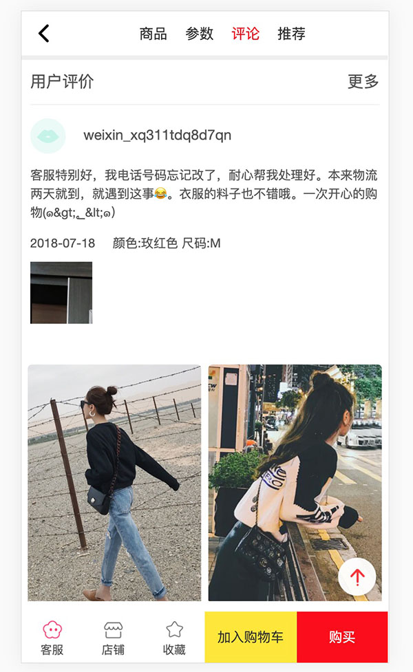
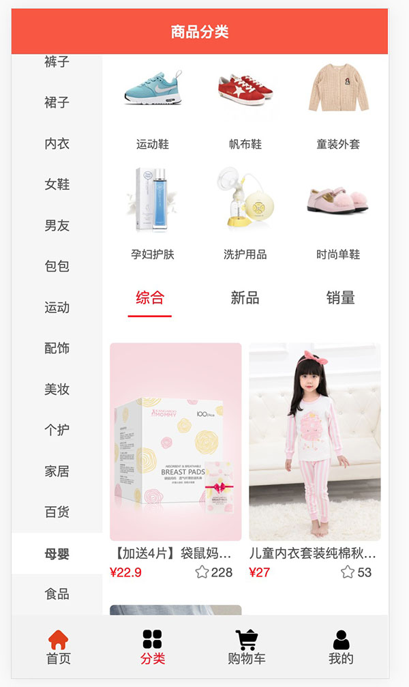
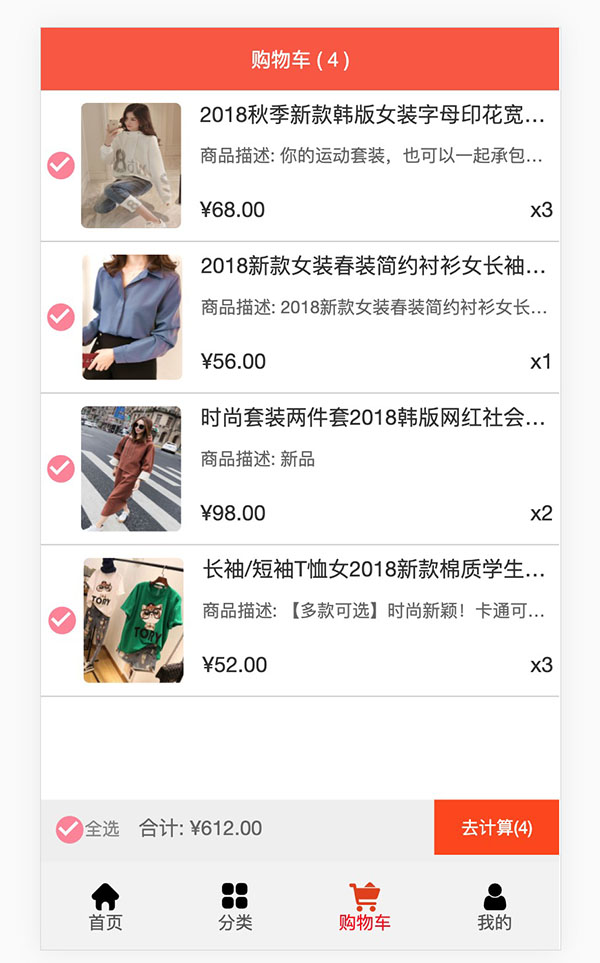

# 练习模仿蘑菇街商城
#### 带数据接口

## 项目预览

 





目录结构长这样
````
├── public
└── src
    ├── assets
    ├── common
    ├── components
    ├── network
    ├── router
    ├── store
    └── views
````

功能
* 轮播
* 上拉加载更多
* 回到顶部
* 加入购物车
* 购物车全选
* 全局 Toast 组件
* 商品详情页滚动定位菜单栏
* 分类展示
* ~~注册登录~~


```
安装依赖包
npm install

启动本地服务
npm run serve

打包
npm run build
```


### Customize configuration
See [Configuration Reference](https://cli.vuejs.org/config/).
